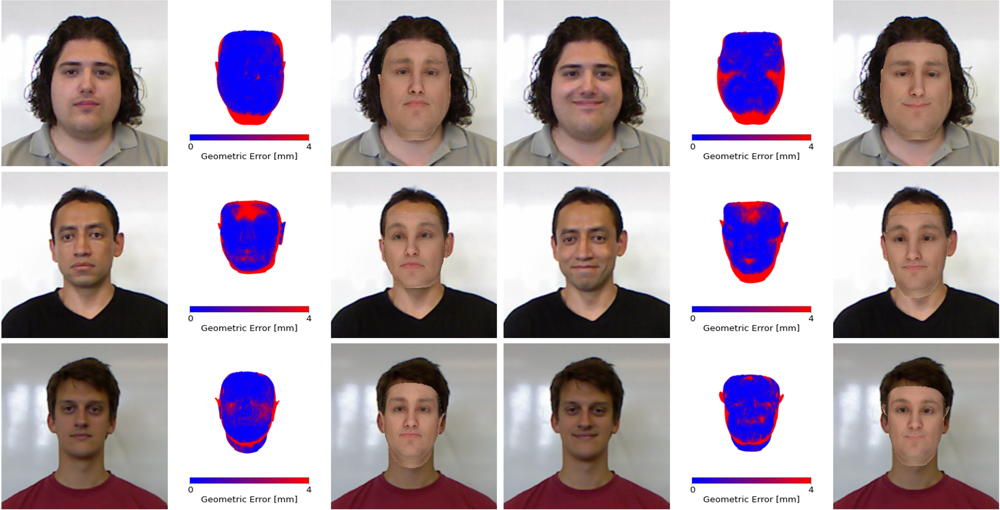
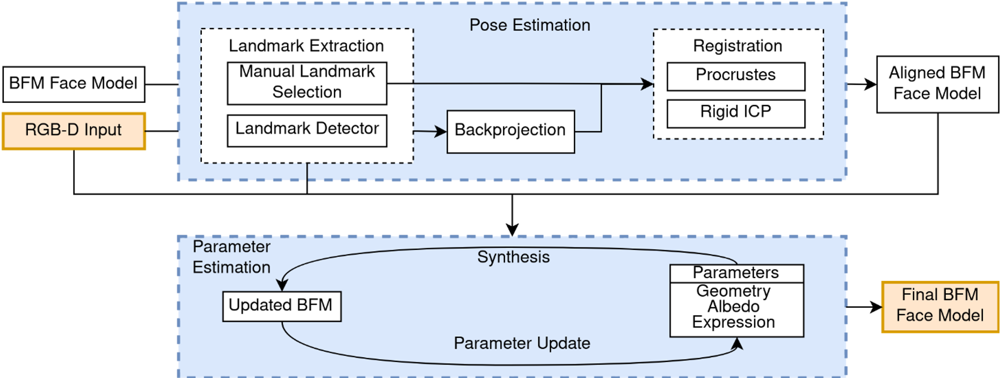
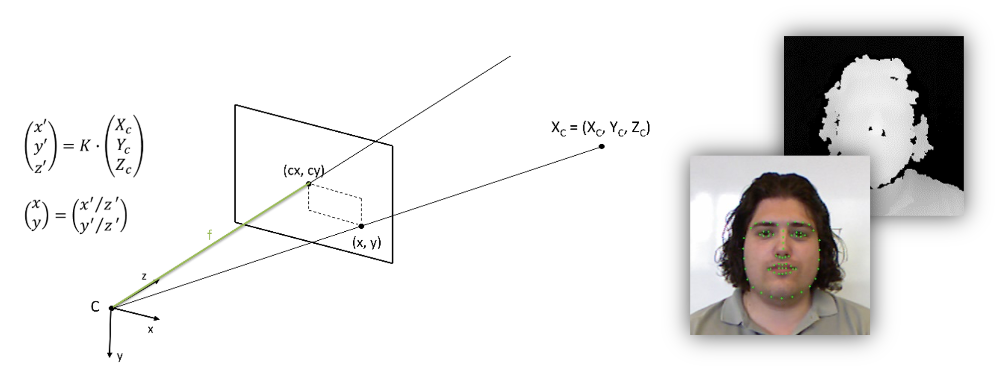
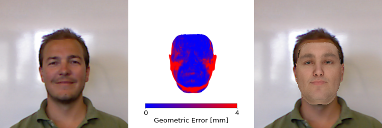

# Face Reconstruction project

In our project, we present an approach for 3D face reconstruction which does not require labor-intensive manual work. Based on a parametric face model, we perform an analysis-by-synthesis loop to reconstruct the 3D face geometry (.ply) from a **single** RGB-D input image (256x256, Kinect v1). **Furthermore**, we apply an expression transfer between a source person and a target person.

## Reconstruction result

  

  

# Requirements
## main scripts (C++, face reconstruction)
  - Linux OS (tested on Arch and Debian)
  - GCC Compiler
  - CMake
  - CXX standard library 17
  - Dlib C++ library [here](https://github.com/davisking/dlib)
  - FLANN [here](https://github.com/flann-lib/flann)
  - Eigen C++ library [here](https://eigen.tuxfamily.org/index.php?title=Main_Page)
  - OpenCV 4.x- [here](https://opencv.org/)
  - Free Image [here](https://freeimage.sourceforge.io/)
  - HDF5 C/C++ library [here](https://www.hdfgroup.org/downloads/hdf5/)
  - glog [here](https://github.com/google/glog)
  - Boost
  - Ceres

## visualization (python)
  - numpy
  - trimesh
  - pyrender
  - matplotlib
  - Pillow

## Dataset
### RGB-D scans of human faces
- EURECOM [[paper]](https://ieeexplore.ieee.org/document/6866883)
- Download link: 

      wget http://rgb-d.eurecom.fr/files/EURECOM_Kinect_Face_Dataset.zip
      mv EURECOM_Kinect_Face_Dataset ./data

### Parametric face model
Parametric face model
- Basel Face Model (BFM) 2017 [[paper]](https://ieeexplore.ieee.org/abstract/document/8373814)

      mv model2017-1_bfm_nonmouth.h5 ./data

# Description
## Face model parameter optimization
- Main scripts and associating header    
  - Optimizer-rk-ALL.cpp
  - Optimizer-ALL.h

- Pipeline Overview

  - In the main scripts, we start by reading the BFM hdf5 file and loading the corresponding data of the face model (mean, variance, and principal components for SHAPE, COLOR, and EXPRESSION). It is followed by back-projection of the depth map and detection of 68 landmarks (dlib landmarks, 68dims) using the dlib C++ library (pre-trained model) on the RGB image. 

    
    

  - By using hand-picked corresponding landmarks in the BFM average mesh (BFM landmarks, 68dims, red_color), we estimate the pose of the average mesh w.r.t. the dlib landmarks (green color) by using the Procrustes Algorithm (rough initialization) and Rigid ICP (pose refinement). By applying the estimated pose to the BFM average face (gray mesh), we get an aligment between our BFM face model and the input RGB-D data. 

    

  - Finally, analysis by synthesis approach is used to reconstruct face geometry given single RGB image (256px256p) optimizing energy function w.r.t Basel face model parameters for shape(75dim), texture(50dim), and expression(50dim).

    

- CMake

      mkdir build
      buid
      cmake ..
      cmake --build .

- How to run

      build
      ./optimization_example_all [option]
        -h [ --help ]                produce this help message
        -p [ --person_id ] arg (=42) person identifier
        -s [ --session ] arg (=1)    session number (1 or 2)
        --expression arg (=Smile)    face status (Neutral, Smile)

## Visualization of results

- Main scripts

      ./tools/visualization.py

- How to run

      tools
      python visualisation.py [index] [expression] [save_figure]
        [index] input data index
        [expression] Neutral, Smile
        [save_figure] True/False

- Outputs

      ./tools/*.png

You will get the result of a rendered image like following.

From left-handside, Input RGB image with selected expression, Geometric error visualization, and rendering result of optimized face mesh on top of RGB input.

## Entire pipeline
- How to run with shell scripts

      tools
      zsh/bash batch_process.sh

By modifying the loop range or sprecifying the input data indices, you can run the face model parameter optimization over multiple inputs via the command line.

## Outputs

# Contributors
    Ryoto	Kato
    Marco	Busch	     
    Ben Robert Sturgis		
    Kevin	Qu	         	 	      
