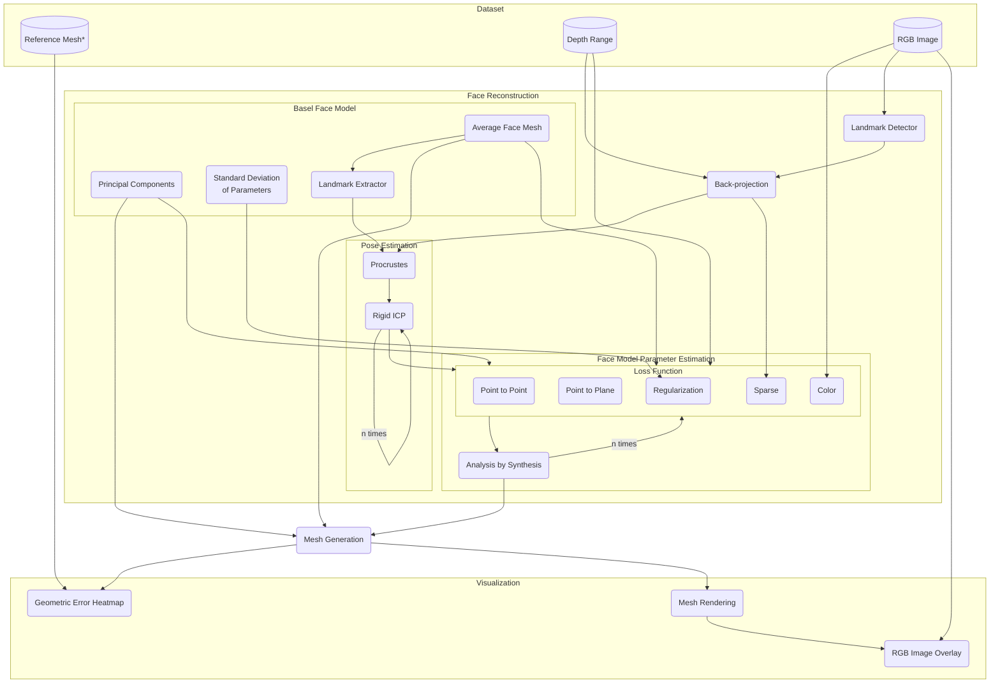
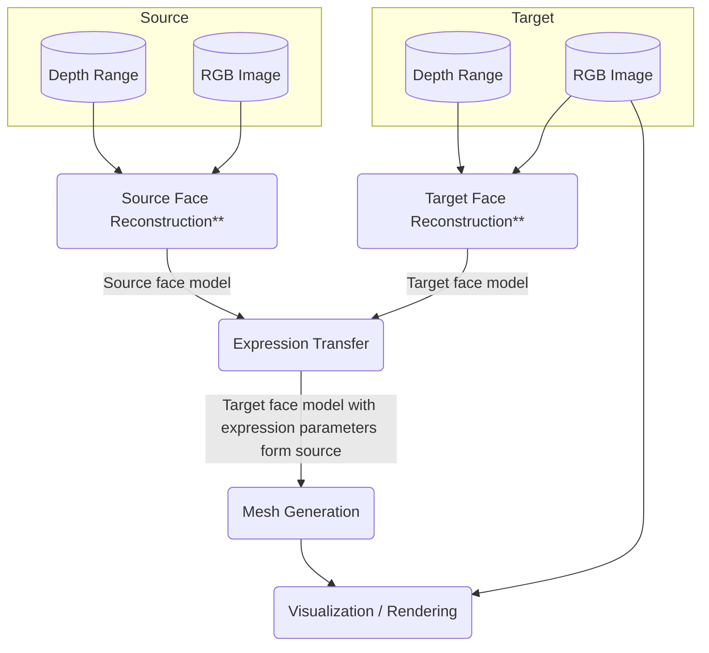

# Facial Expression Transfer Design

## Face Reconstruction Data Flow

*If not available this can be substituted by a mesh created form the depth point cloud

## Extension for Expression Transfer

**Target/Source Face Reconstruction both refer to the Face Reconstruction process shown above
