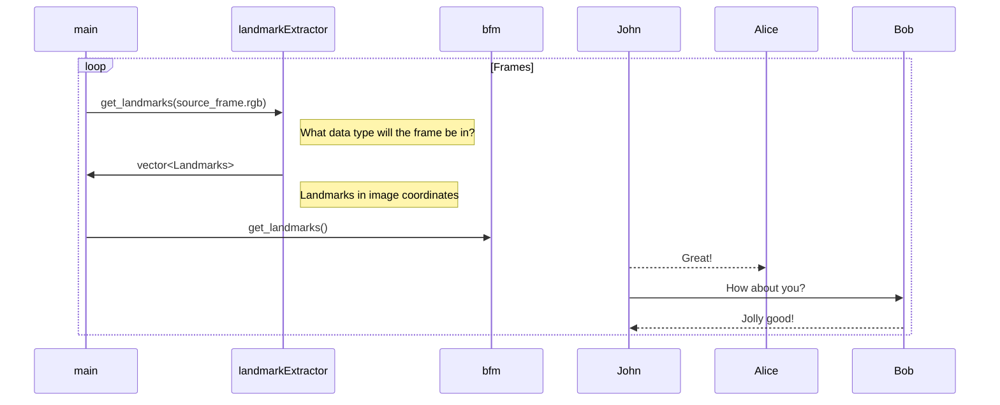
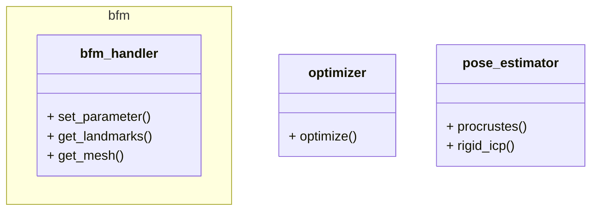

# Facial Expression Transfer Design

## Sequence Diagram

```mermaid
    sequenceDiagram
    loop Frames
        main->>landmarkExtractor: get_landmarks(source_frame.rgb)
        Note right of landmarkExtractor: What data type will the frame be in?
        landmarkExtractor->>main: vector<Landmarks>
        Note right of landmarkExtractor: Landmarks in image coordinates

        main->>bfm: get_landmarks()


        John-->>Alice: Great!
        John->>Bob: How about you?
        Bob-->>John: Jolly good!
    end
```

## Class Diagram #TODO

```mermaid
    classDiagram
    namespace bfm {
        class bfm_handler {
            + set_parameter()
            + get_landmarks()
            + get_mesh()
        }
    }

    class optimizer {
        + optimize()
    }
    class pose_estimator {
        + procrustes()
        + rigid_icp()
    }

```